<!-- visual-showroom:start -->
<p align="center">
  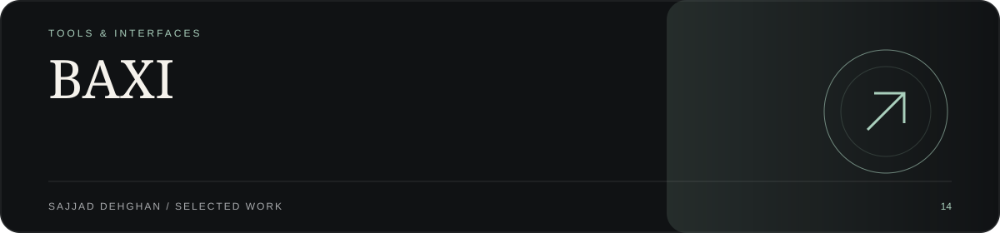
</p>

<p align="center">
  <strong>BAXI</strong><br>
  TOOLS &amp; INTERFACES
</p>

<p align="center">
  <a href="https://sajjad-dehghan-personal-site.prisoner-sedwna.workers.dev/projects/baxi"><strong>Explore the showroom ↗</strong></a> ·
  <a href="#implementation--original-documentation">Setup &amp; implementation ↓</a>
</p>

A ride and freight prototype, now with a web interface for passenger, driver, wallet and HR journeys. The showroom documents the current web edition with synthetic data; the historical PyQt/MySQL desktop source is preserved.

## Visual tour

[](https://sajjad-dehghan-personal-site.prisoner-sedwna.workers.dev/projects/baxi)

<p align="center">
  <a href="https://sajjad-dehghan-personal-site.prisoner-sedwna.workers.dev/projects/baxi"></a>
  <a href="https://sajjad-dehghan-personal-site.prisoner-sedwna.workers.dev/projects/baxi">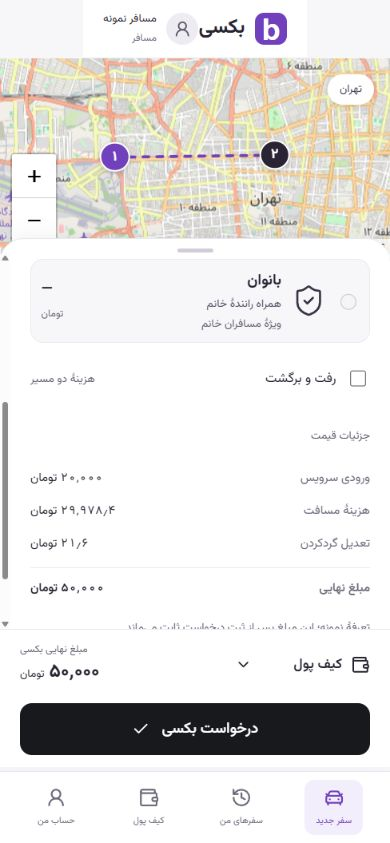</a>
  <a href="https://sajjad-dehghan-personal-site.prisoner-sedwna.workers.dev/projects/baxi">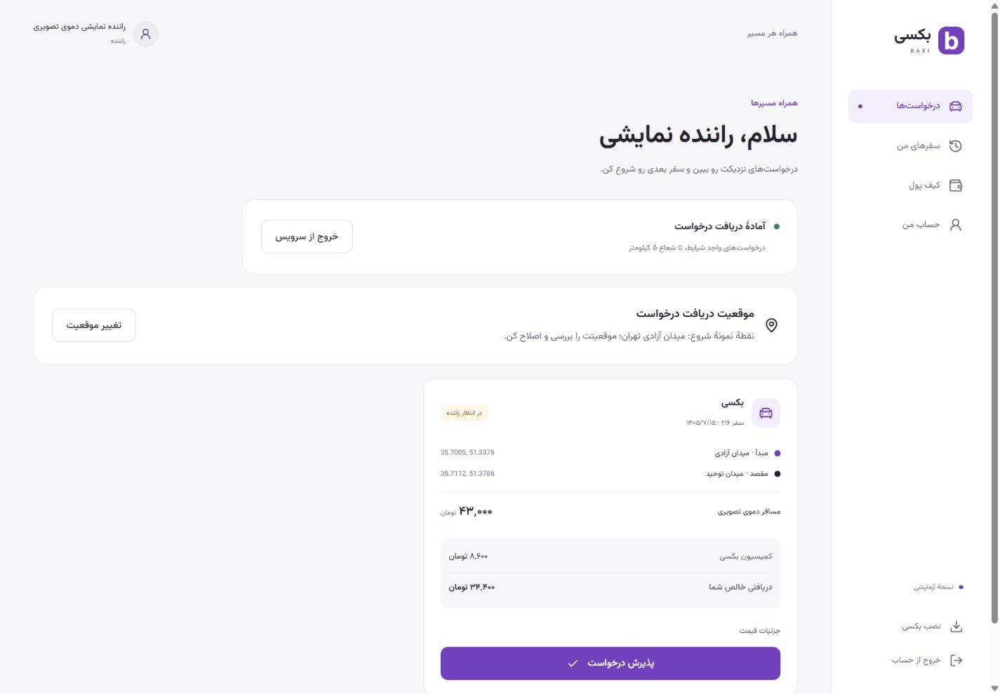</a>
</p>

1. BAXI web edition · map and upfront fare with synthetic data
2. Service selection and final fare
3. Mobile price breakdown
4. Nearby offer, commission and net earnings

Current web screenshots; synthetic accounts, documents, journeys and fares. No live SMS, banking or street routing. Map: © [OpenStreetMap contributors](https://www.openstreetmap.org/copyright). The original README below contains all 31 views.

## Implementation & original documentation

The existing run instructions, architecture, limitations and credits are preserved below.

---
<!-- visual-showroom:end -->

<div align="center">
  
  <h1>BAXI · بکسی</h1>
  <p><strong>Choose two places. Know the price. Follow the journey.</strong></p>
  <p>A Persian, map-first ride and cargo PWA for Tehran.<br>Rebuilt from an undergraduate database project, with product decisions and transactional behavior you can inspect.</p>
  <p>
    <a href="#product-overview">Watch the overview</a> ·
    <a href="https://github.com/sajjad-dehghan/BAXI/actions/workflows/ci.yml">Build &amp; test CI</a> ·
    <a href="#run-it-locally">Run the demo</a> ·
    <a href="docs/README.fa.md">راهنمای فارسی</a> ·
    <a href="docs/case-study.fa.md">روایت محصول</a>
  </p>
  <p><strong>Persian RTL · Installable PWA · React + TypeScript · FastAPI · MySQL 8.4</strong></p>
</div>

<p dir="rtl">بکسی از یک پروژهٔ دانشگاهی دسکتاپ به یک اپلیکیشن وب فارسی برای سفر و حمل بار در تهران بازسازی شده است. مبدأ و مقصد روی نقشه انتخاب می‌شوند، قیمت پیش از درخواست مشخص است و مسافر، راننده و کارکنان هر کدام جریان کاری خود را دارند. این مخزن هم برنامهٔ قابل اجراست، هم مستند تصمیم‌های محصول و فنی آن.</p>

**This is a working educational demo.** It persists journeys and settlements in MySQL, using synthetic accounts and simulated money. Tariffs are illustrative; SMS, banking, street routing and insurance are not connected. There is no hosted public demo: the command below starts it on your own computer.

[Video overview](#product-overview) · [Product experience](#the-product-experience) · [Driver tour](#the-driver-experience) · [HR tour](#the-hr-experience) · [Pricing](#a-price-you-can-explain) · [Architecture](#under-the-interface) · [Development](#develop-locally) · [Verification](#verified-behavior) · [Origins & credits](#origins-and-credits)

## Product overview

<p align="center">
  <a href="https://github.com/sajjad-dehghan/BAXI/raw/refs/heads/main/docs/media/baxi-overview.mp4">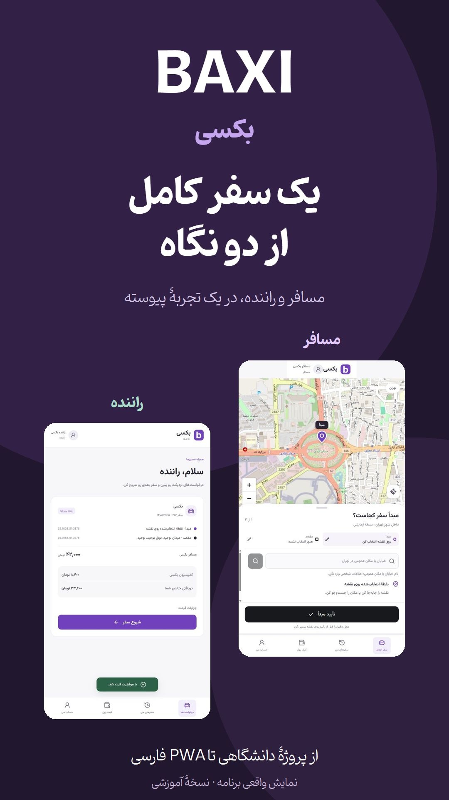</a>
</p>

**[Download the 82-second introduction · MP4](https://github.com/sajjad-dehghan/BAXI/raw/refs/heads/main/docs/media/baxi-overview.mp4)**

<p dir="rtl"><strong>معرفی کلی بکسی؛ یک سفر کامل از دو نگاه.</strong> از انتخاب مبدأ و مقصد و دیدن قیمت تا پذیرش راننده، شروع و پایان سفر، تسویه، امتیازدهی دوطرفه و سوابق. برای دریافت و تماشای ویدیو روی کاور یا لینک بالا بزنید.</p>

Recorded from the running app with synthetic accounts and simulated wallet payments. Portrait **1080 × 1920**, Persian titles in **Pinar**, original background music, and a **[silent edition](https://github.com/sajjad-dehghan/BAXI/raw/refs/heads/main/docs/media/baxi-overview-silent.mp4)**. **[Persian subtitles](docs/media/baxi-overview.fa.srt)** · **[Media details and LinkedIn caption](docs/media/README.md)**.

## The product experience

BAXI brings four services into one journey: **BAXI** for passenger rides, **WOMEN** for female passengers and drivers, **BOX** for parcels, and **BAAR** for urban cargo. A shared journey model connects booking, dispatch, payment and the receipt.

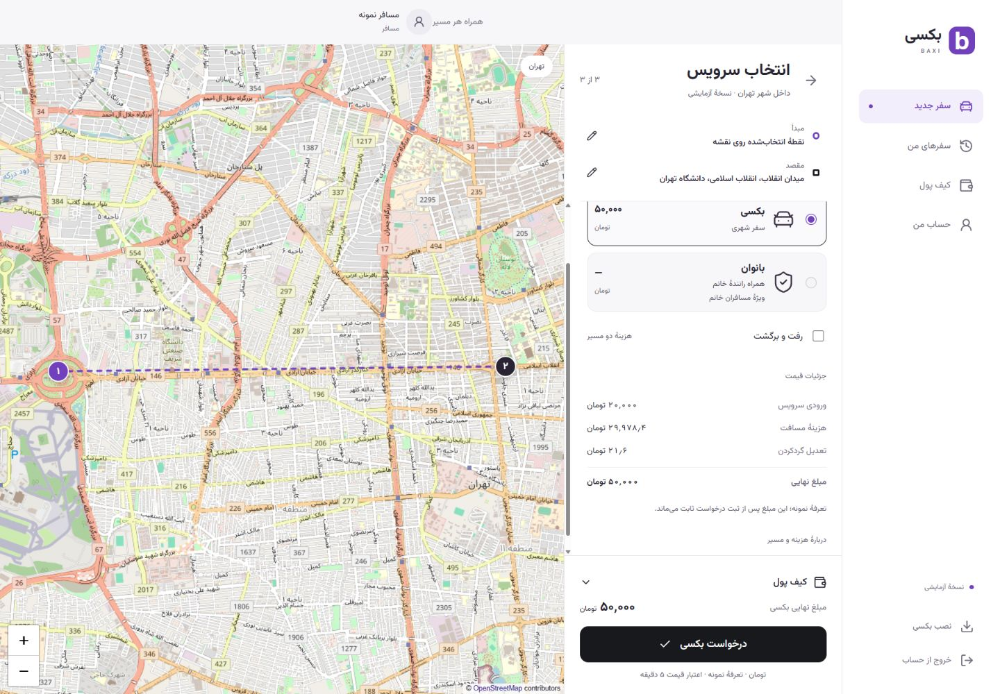

<table>
  <tr>
    <td align="center" width="50%">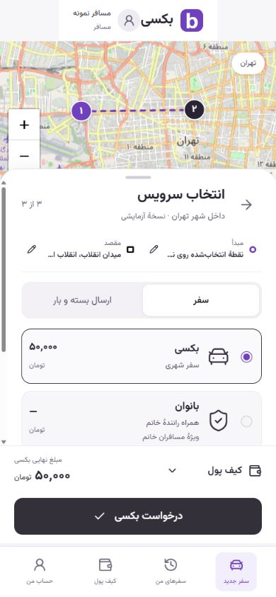<br><strong>Compare before requesting</strong><br>Service, payment and the final fare in one place.</td>
    <td align="center" width="50%"><br><strong>Understand the amount</strong><br>A breakdown that adds up to the booked fare.</td>
  </tr>
</table>

These are screenshots of the running app with synthetic data and actual OpenStreetMap tiles. [Map sources and attribution →](docs/map.md)

### Decisions that shape the journey

- **Start with the map.** Confirm the origin, then the destination using a movable center pin. Explicit public-place search and optional device location help position it. Tehran's city boundary is enforced in both the browser and API.
- **Make the commitment clear.** Compare final service prices, choose cash or wallet, inspect the calculation, then request. An expired quote requires a fresh price and another confirmation.
- **Keep the journey continuous.** Assigned driver and vehicle, trip progress, cancellation before departure, receipt and rating follow the same booking. Status updates use polling.
- **Design for recovery.** A wallet shortfall offers a way forward. Confirmed places survive a visit to the wallet. Retrying a booking or transfer must not duplicate it.
- **Use one flow across screen sizes.** Mobile uses a map and bottom sheet with a persistent primary action; desktop uses a panel beside the map. Persian RTL, bundled Vazirmatn and restrained purple accents carry through both.

The redesign follows familiar ride-hailing interaction patterns. It is an implemented design review, not a claim of completed user research or measured conversion improvement. [UX review and acceptance criteria →](docs/ux-review.fa.md)

### Three roles, one system

| Role | What works in the demo |
| --- | --- |
| **Passenger** | Phone sign-in and registration; four-service booking; passenger round trips; cargo details; upfront price and payment choice; assigned vehicle; pre-departure cancellation; history, receipts, ratings and simulated wallet top-ups. |
| **Driver** | Vehicle registration and four private documents; verification status; reported location; eligible requests within 5 km; acceptance, start and completion; gross fare, commission and net earnings; simulated withdrawals. |
| **Staff** | Personnel sign-in, private document review and recorded approval/rejection. HR managers can create staff accounts and run all 20 read-only reports. |

WOMEN eligibility, cargo weight and vehicle capacity are checked on the server. Nearby dispatch uses the driver's last reported location; it does not imply continuous vehicle tracking.

## The driver experience

<p dir="rtl"><strong>تجربهٔ راننده، از بررسی مدارک تا دریافت درآمد.</strong> این گالری وضعیت‌های مختلف کار روزانه، سفر و کیف پول را نشان می‌دهد. بخش‌های بازشونده شامل تصاویر بیشتر از ثبت‌نام، مدارک، موقعیت و خطاها هستند.</p>

**Know the earnings before accepting.** A nearby offer shows the places, gross fare, BAXI commission and driver's net amount together. This desktop offer and the mobile journey below follow the **same synthetic trip**: **43,000 toman fare − 8,600 commission = 34,400 net earnings**.


### Accept → start → settle → rate

<table>
  <tr>
    <td align="center" width="50%">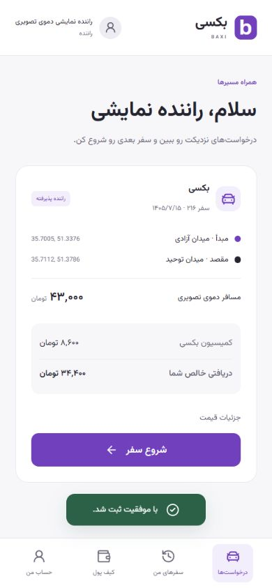<br><strong>۱ · پذیرفته‌شده / Accepted</strong><br>The assigned trip stays visible; starting it is an explicit action.</td>
    <td align="center" width="50%">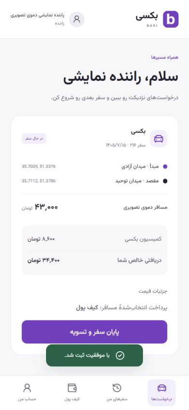<br><strong>۲ · در حال سفر / In progress</strong><br>The passenger's selected payment method accompanies completion and settlement.</td>
  </tr>
  <tr>
    <td align="center" width="50%">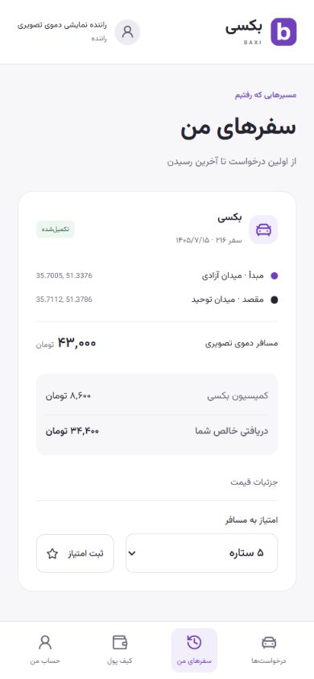<br><strong>۳ · رسید / Completed</strong><br>History retains the booked fare, commission and net amount, with passenger rating.</td>
    <td align="center" width="50%">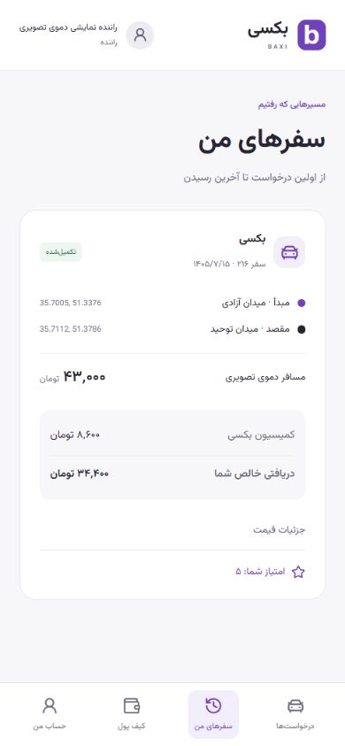<br><strong>۴ · امتیاز ثبت‌شده / Rated</strong><br>The saved rating replaces the submission form.</td>
  </tr>
</table>

<details>
<summary><strong>Registration and verification · ثبت‌نام، مدارک، انتظار و رد</strong></summary>

**Registration collects the driver and vehicle details.** The lower part of the same form accepts four private documents; the demo can supply clearly labelled synthetic documents. These captures show an unsubmitted form, not a newly approved account.

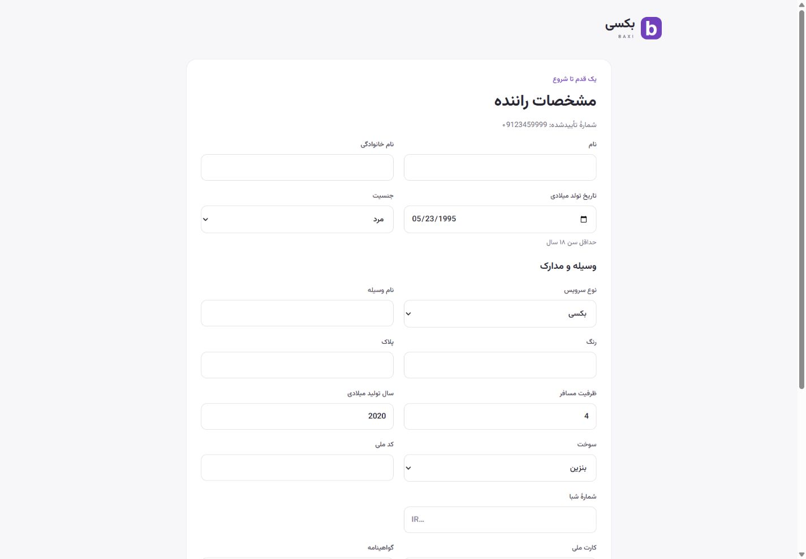

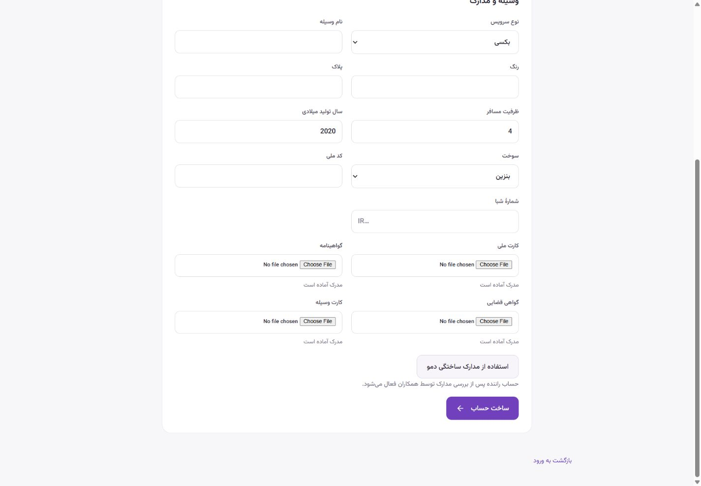

<table>
  <tr>
    <td align="center" width="50%">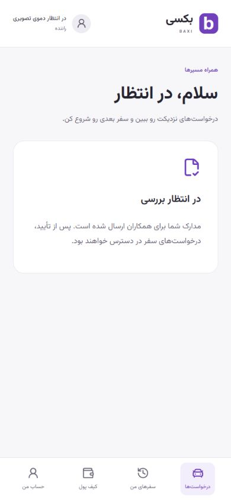<br><strong>در انتظار بررسی / Pending</strong><br>Requests become available after staff approval.</td>
    <td align="center" width="50%">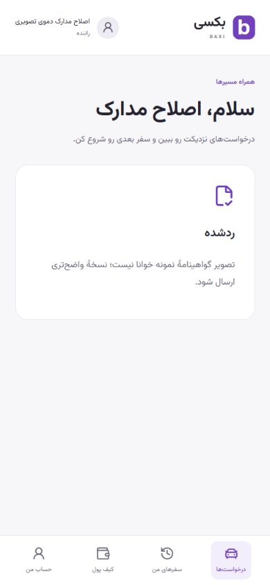<br><strong>ردشده / Rejected</strong><br>The reason recorded in HR appears in the driver's view.</td>
  </tr>
</table>

The rejection screen communicates the decision; the current app does not provide an in-app document resubmission flow.

</details>

<details>
<summary><strong>Availability and location · خارج از سرویس، موقعیت و انتظار درخواست</strong></summary>

<table>
  <tr>
    <td align="center" width="50%">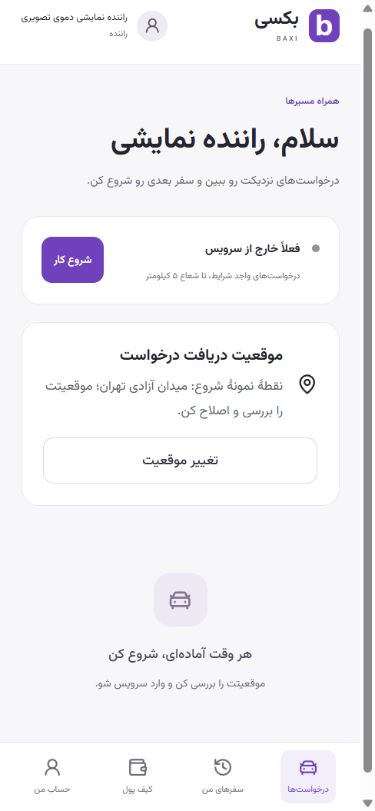<br><strong>خارج از سرویس / Off duty</strong><br>Review the reported location before starting work.</td>
    <td align="center" width="50%">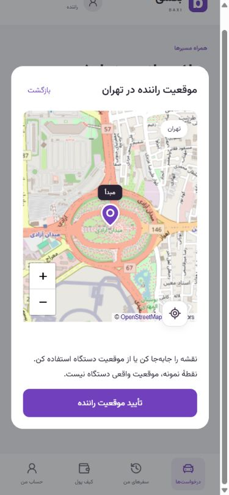<br><strong>موقعیت روی نقشه / Location</strong><br>Confirm a point inside Tehran; the initial Azadi Square point is a sample.</td>
  </tr>
</table>

**On duty, with no matching request.** The empty state explains that an eligible request will appear here. Dispatch uses a 5 km radius around the last reported location, with service and capacity eligibility checks.

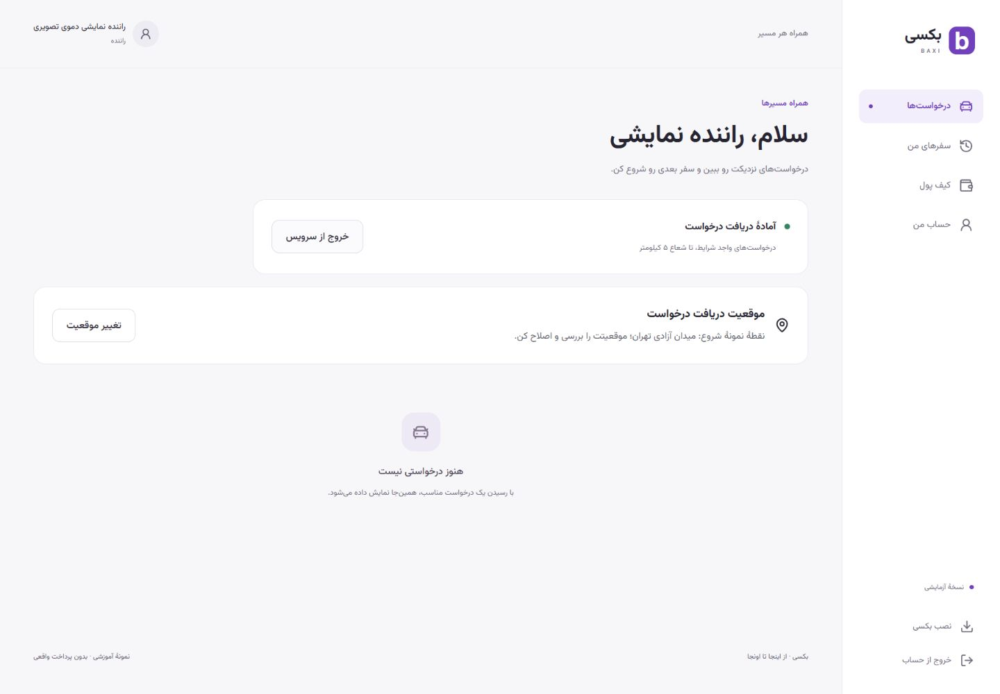

</details>

<details>
<summary><strong>Fare details, wallet and account · جزئیات کرایه، برداشت و حساب</strong></summary>

<table>
  <tr>
    <td align="center" width="50%">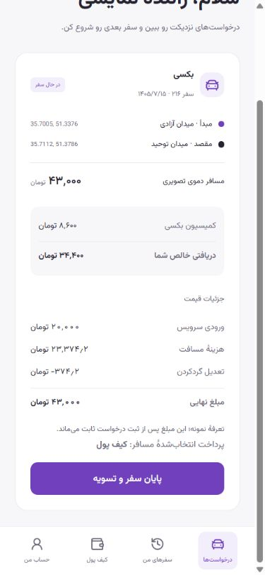<br><strong>جزئیات کرایه / Fare details</strong><br>The stored calculation explains the same 43,000 toman fare.</td>
    <td align="center" width="50%">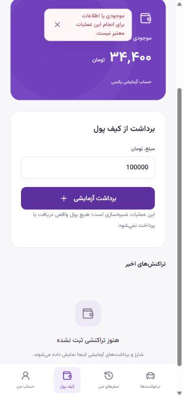<br><strong>موجودی ناکافی / Recovery</strong><br>A 100,000 toman withdrawal fails against a 34,400 toman balance.</td>
  </tr>
  <tr>
    <td align="center" width="50%">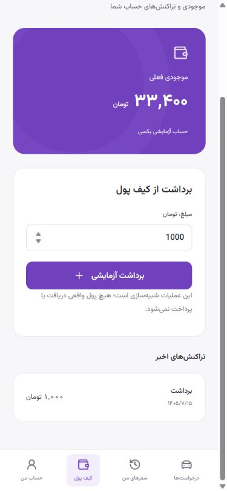<br><strong>برداشت ثبت‌شده / Wallet</strong><br>After a 1,000 toman simulated withdrawal, 33,400 remains.</td>
    <td align="center" width="50%">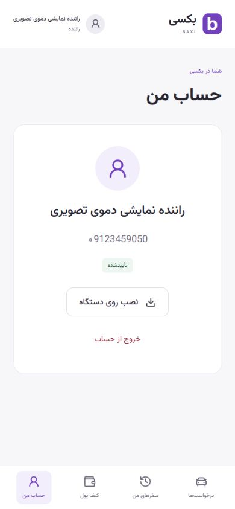<br><strong>حساب راننده / Account</strong><br>Verification status, installation help and sign-out stay accessible.</td>
  </tr>
</table>

**The same wallet on desktop:** balance, simulated withdrawal and its transaction record.

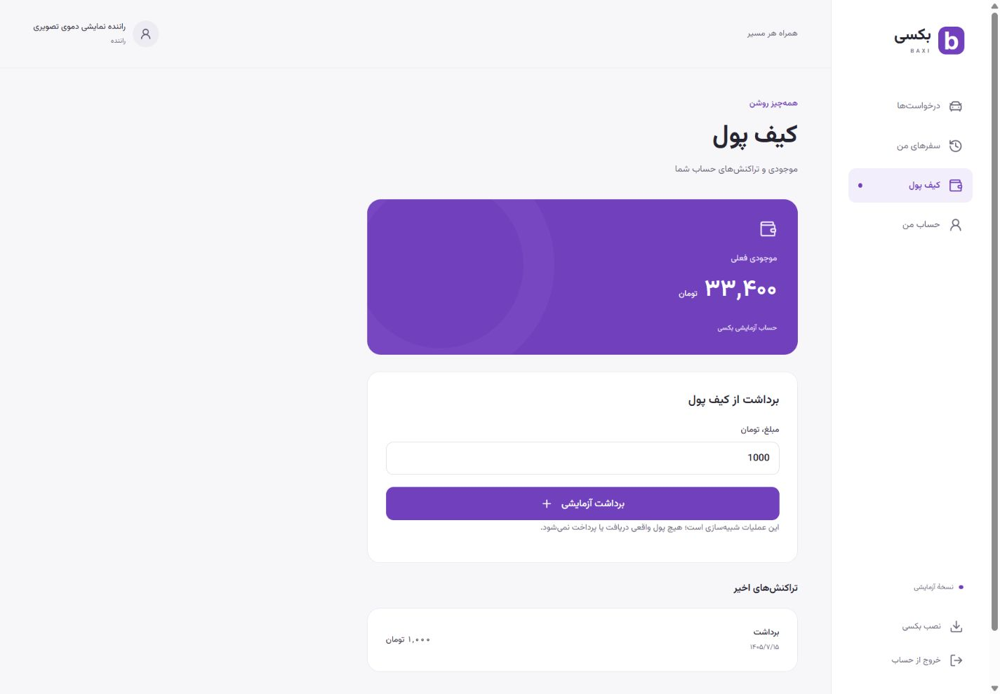

Wallet transaction history here lists simulated top-ups/withdrawals; the trip's fare and earnings are retained in trip history. No real bank transfer occurs.

</details>

## The HR experience

<p dir="rtl"><strong>پنل منابع انسانی، از صف پرونده تا ثبت تصمیم و گزارش.</strong> تصاویر شامل پروندهٔ در انتظار، مدارک آمادهٔ بررسی، تأیید، رد با دلیل، دسترسی کارشناس و مدیر، گزارش‌ها و فرم همکار جدید هستند.</p>

**A queue with explicit review states.** Pending, approved and rejected filters separate the work. Selecting a driver opens their private documents beside the queue on desktop. The first capture precedes the demo decisions; later counts reflect those decisions.

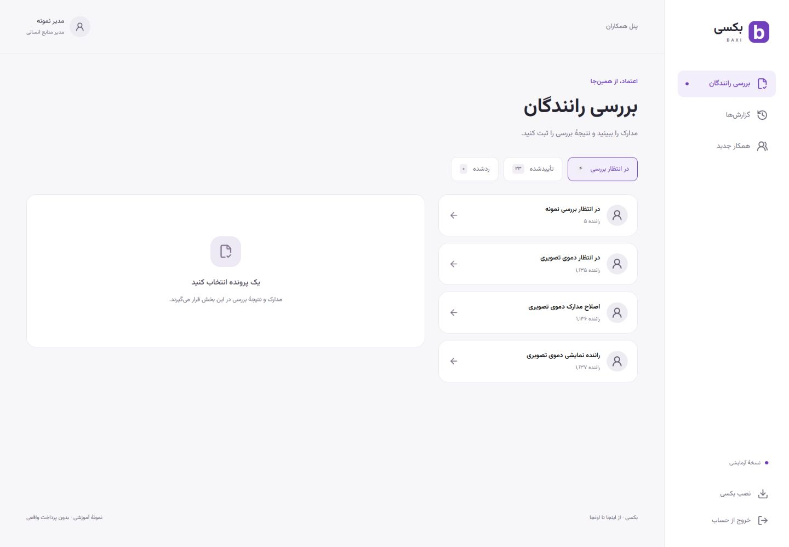

### Review documents → record a decision

**Review all four documents and provide a reason when rejecting.** This capture is scrolled to the review actions. The filled reason is a draft; this pending example was left unsubmitted. The rejected example below is a separate synthetic account with a saved decision.

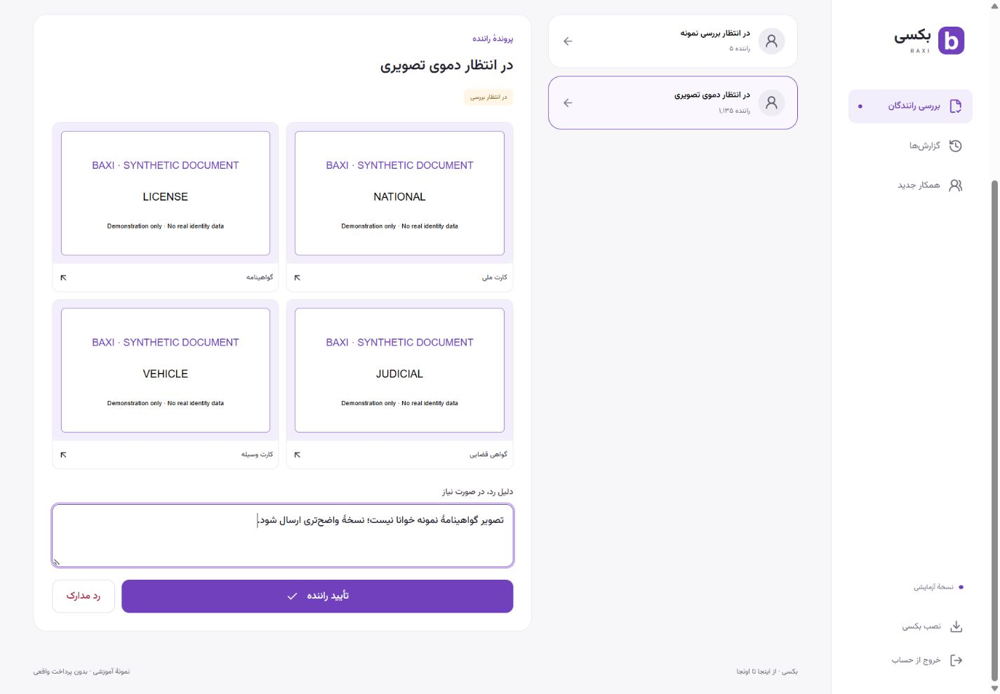

<table>
  <tr>
    <td align="center" width="50%">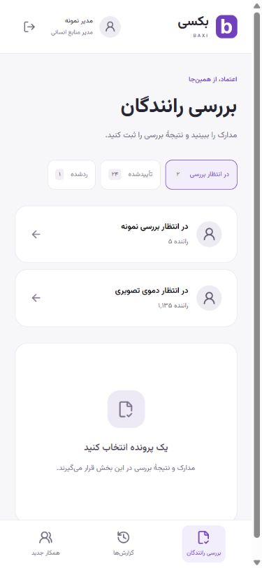<br><strong>صف موبایل / Mobile queue</strong><br>The same review states with mobile navigation.</td>
    <td align="center" width="50%">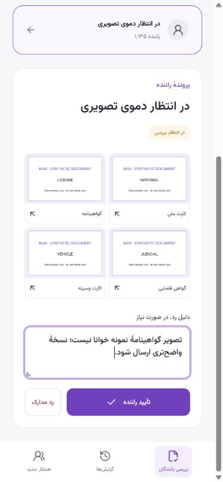<br><strong>بررسی موبایل / Mobile review</strong><br>Documents and decision controls remain together on the smaller screen.</td>
  </tr>
</table>

<details>
<summary><strong>Recorded outcomes and role boundaries · تأیید، رد و سطح دسترسی</strong></summary>

**Approved:** the saved status is visible on the selected file. This is the driver used in the complete trip walkthrough above.

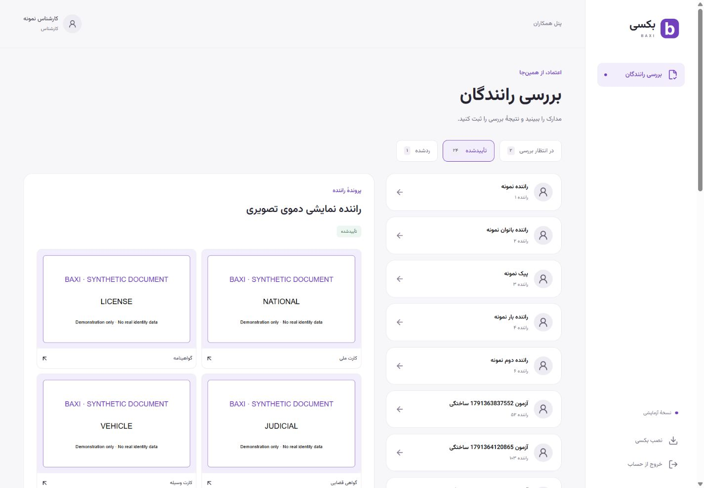

**Rejected with a reason:** the saved explanation appears below the documents and is also shown to the driver in the rejected-state screenshot above.

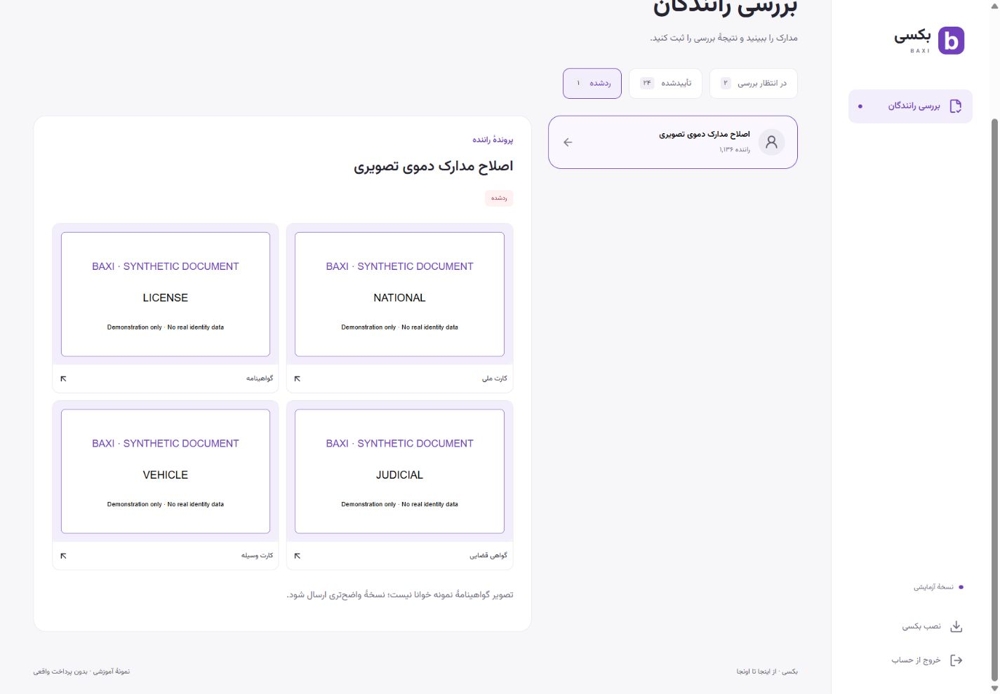

**Reviewer access:** the reviewer account has document review navigation. Reports and staff creation are available to the HR manager; authorization is also enforced by the API.

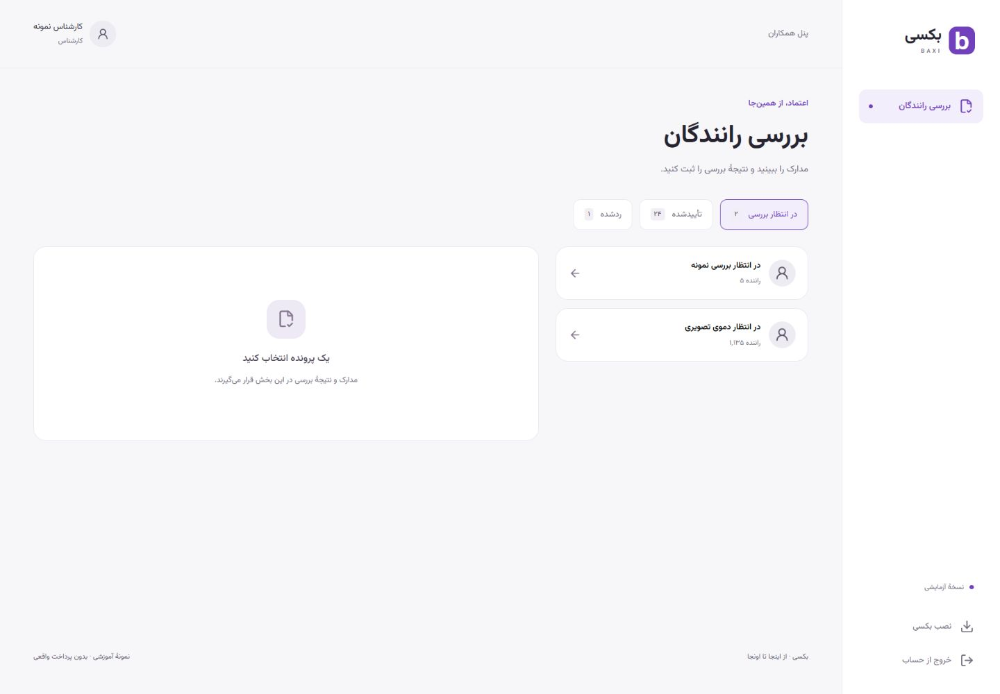

</details>

<details>
<summary><strong>Reports with data and without data · گزارش‌های عملیاتی، حقوق و حالت خالی</strong></summary>

The manager can choose from **20 read-only reports**. These examples cover revenue, employee payroll and a report with no matching rows. Amounts are displayed in toman; historical fractions remain visible.

**Revenue by service:** journey count and gross revenue across the four services.

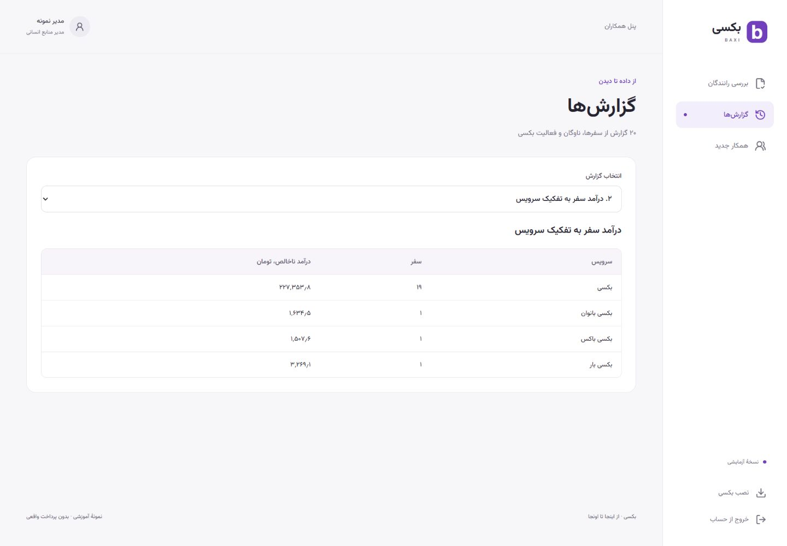

**Payroll by department:** employee count and aggregate salary. These are seeded synthetic figures, not actual compensation data.

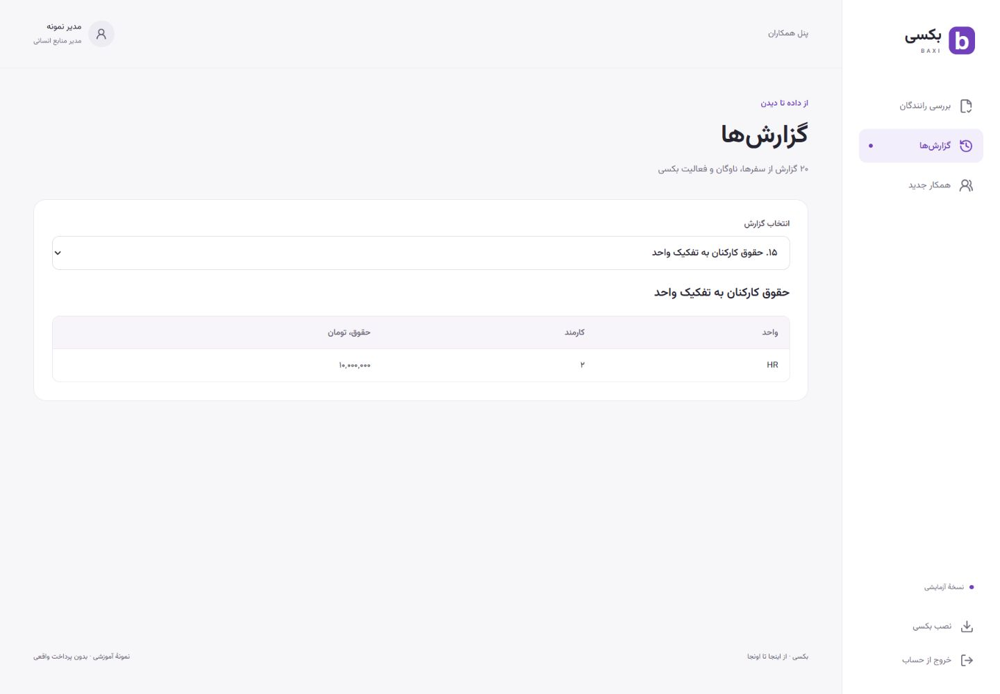

**No matching data:** the WOMEN compliance report has no violating rows in this local dataset. The interface shows an explicit empty state rather than a fabricated table.

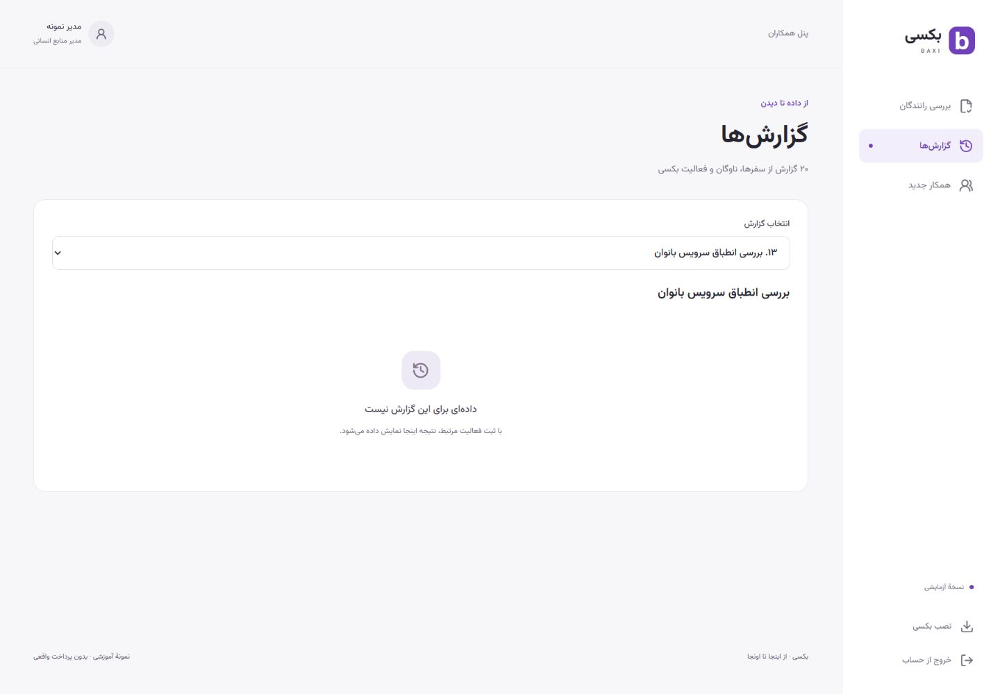

</details>

<details>
<summary><strong>New staff form · فرم همکار جدید</strong></summary>

The HR manager's form collects identity fields, salary in toman, department, position, skill level and education. This is an **unsubmitted form**; no extra staff account was created for the capture.

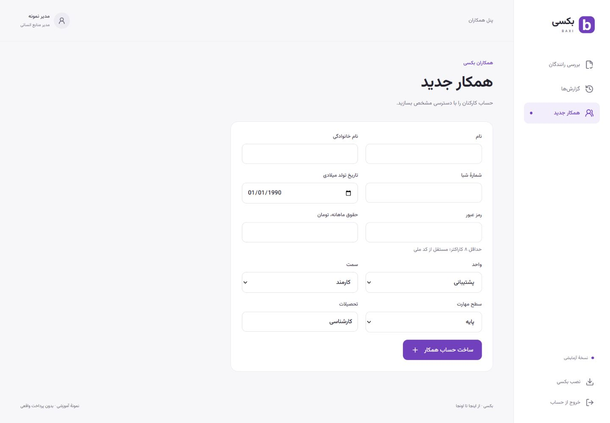

</details>

All driver and HR images were captured from the running local app on **2026-10-07**, with synthetic accounts, synthetic documents and simulated money. Desktop captures target 1440 × 1000; mobile captures target 390 × 844. Some views are scrolled to show the relevant controls. They document the implemented states, not physical-device testing or every error combination. [Screenshot index, state coverage and reproduction notes →](docs/screenshots/README.md)

## Run it locally

**Prerequisite:** Docker Desktop with Compose running. The first build needs internet access for images and dependencies.

```sh
git clone https://github.com/sajjad-dehghan/BAXI.git
cd BAXI
docker compose up --build -d
```

Open **[localhost:8080](http://localhost:8080)**. Compose starts the web app, API and MySQL together, and seeds synthetic accounts, documents and completed journeys. Services bind to the local machine.

Already cloned? Run only the last command from the repository root.

```sh
docker compose ps          # Check service health
docker compose logs api    # Inspect API startup
docker compose down        # Stop; keep database and uploads
```

Database and uploads persist in named volumes. Initialization runs only on an empty database. Existing rebuilt PWA databases need the additive **002 booking-context** and **003 pricing** migrations after backup; see the [upgrade instructions](docs/database.md#upgrading-an-existing-pwa-demo). This setup does not import the original Qt application's database.

### Walk through a complete ride

1. Open two browser profiles, or a normal and a private window.
2. Sign in as a passenger, select two points inside Tehran, compare services and confirm the fare and payment method.
3. In the other window, sign in as the corresponding driver, start work and accept the nearby request.
4. Start and finish the trip as the driver. Review fare, commission and net earnings.
5. Return to the passenger's receipt, check the settlement and leave a rating.

Choose a role on the sign-in screen and use **«ورود با حساب نمونه»**, or enter a synthetic account below. Demo phone codes appear on screen; no SMS is sent.

<details>
<summary><strong>Demo accounts for every role</strong></summary>

| Account | Phone / personnel code |
| --- | --- |
| Passenger | `09120000010` |
| Female passenger | `09120000020` |
| Passenger driver | `09120000030` |
| Female driver | `09120000040` |
| Box courier | `09120000050` |
| Cargo driver | `09120000060` |
| Driver awaiting review | `09120000070` |
| HR manager / reviewer | `9001` / `9002` |

Staff demo password: `BaxiDemo!2026`. These credentials are public, synthetic and intended only for the local demo.

</details>

### Install the PWA

Open the production build online once, then use Chrome/Edge's install action. On iPhone: **Safari → Share → Add to Home Screen**. A self-hosted domain requires HTTPS; localhost supports local testing. The Vite development server intentionally does not register the production service worker.

The public app shell can reopen offline. Signing in, requesting a ride, settling payments and fetching account data require a connection. Private API responses and identity documents are excluded from the service-worker cache.

## A price you can explain

The server owns the fare. A browser cannot submit its own amount.

| Illustrative tariff | Base | Per km | Minimum |
| --- | ---: | ---: | ---: |
| BAXI / WOMEN | 20,000 toman | 6,000 toman | 40,000 toman |
| BOX | 15,000 toman | 4,000 toman | 30,000 toman |
| BAAR | 60,000 toman | 12,000 toman | 100,000 toman |

Distance currently means **straight-line geodesic distance**, not a street route. WOMEN has exactly the same tariff as BAXI.

```text
One-way fare = round half up to 1,000 toman (
    max(minimum, base + distance charge) × cargo weight factor
)
Passenger return journey = 2 × rounded one-way fare
```

BOX weight bands are up to **5 / 10 / 20 kg**; BAAR bands are up to **500 / 1,000 / 2,000 kg**. Their respective factors are **1 / 1.25 / 1.5**, with vehicle capacity checked separately. Fragility and customer assistance are handling information, with no extra charge. Declared cargo value does not purchase insurance.

- **Before booking:** an account-bound quote contains an ID, tariff version, exact breakdown and five-minute expiry. Changing the route, service, weight or return option requires a new quote.
- **At booking:** one transaction saves the fare, breakdown, commission and driver net. Reusing the same quote returns the same request. A tariff update cannot silently change a booked fare.
- **At completion:** cash and wallet settlement use the stored amounts and cannot settle twice. The default commission is 20%, configurable per service in a new tariff version.
- **In the interface:** every monetary amount is shown in **toman**. API/storage amounts remain integer **IRR**. Historical fractions of a toman retain one decimal place.

Waiting and pre-start cancellation are free. There is no demand surge, traffic fee, toll, added tax, discount or real insurance in this version. Legacy journeys retain their amounts and previous settlement rules, without invented itemized receipts.

**Policy source:** [`backend/baxi/pricing/policy.json`](backend/baxi/pricing/policy.json) · **Engine:** [`backend/baxi/pricing/engine.py`](backend/baxi/pricing/engine.py) · **Full Persian policy:** [docs/pricing.fa.md](docs/pricing.fa.md)

## Under the interface

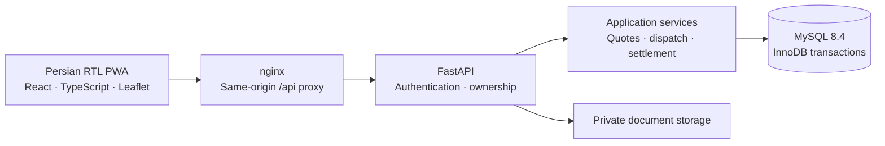
```mermaid
flowchart LR
  P["Persian RTL PWA\nReact · TypeScript · Leaflet"] --> W["nginx\nSame-origin /api proxy"]
  W --> A["FastAPI\nAuthentication · ownership"]
  A --> S["Application services\nQuotes · dispatch · settlement"]
  S --> D[("MySQL 8.4\nInnoDB transactions")]
  A --> U["Private document storage"]
```

| Layer | Responsibility |
| --- | --- |
| **React + TypeScript + Vite** | Responsive screens, booking state, API client and build-time checks. |
| **Leaflet + OpenStreetMap** | Interactive basemap and shared Tehran boundary; explicit geocoder search. |
| **FastAPI + Python** | Authentication, role/record ownership, input validation and application rules. |
| **MySQL 8.4** | Relational records, views, triggers, row locks and atomic financial operations. |
| **Service worker + manifest** | Installable public shell, versioned assets and offline entry screen. |
| **Docker Compose + nginx** | Reproducible local stack and one browser-facing origin. |

### The invariants matter as much as the screens

- A booking creates its destination, service details and price snapshot together, or creates none of them.
- Competing drivers cannot both accept the same request.
- A completed trip or retried wallet operation cannot move money twice through the API.
- Payment choice, Tehran coverage, WOMEN eligibility, capacity and record ownership are validated on the server.
- Booked price snapshots are immutable; income reports use saved driver earnings.
- Browsers receive neither database credentials nor public links to private driver documents.

Sessions use opaque HttpOnly cookies and server-held state. The current demo runs one API process; shared session storage is needed before multiple instances. [Architecture](docs/architecture.md) · [Database model, reports and migrations](docs/database.md) · [Security boundaries](SECURITY.md)

## Develop locally

Supported baseline: **Python 3.12+ · Node.js 24+ · MySQL 8.4**. Use MySQL from Compose and run the API and frontend on the host.

```sh
docker compose up -d mysql
python -m venv .venv
```

Activate the environment and create your local configuration:

| Shell | Activate | Copy configuration once |
| --- | --- | --- |
| PowerShell | `.venv\Scripts\Activate.ps1` | `Copy-Item .env.example .env` |
| Linux / macOS | `source .venv/bin/activate` | `cp .env.example .env` |

Then install, seed and start the API:

```sh
python -m pip install -r requirements-dev.txt
python backend/scripts/seed_demo.py
npm ci
python -m uvicorn baxi.api:app --app-dir backend --host 127.0.0.1 --port 8000
```

In a second terminal, run `npm run dev` and open **[127.0.0.1:5173](http://127.0.0.1:5173)**. Vite proxies `/api` to the Python server. Interactive API docs are at **[127.0.0.1:8000/api/docs](http://127.0.0.1:8000/api/docs)**.

For PWA/offline testing, use `npm run build` followed by `npm run preview`; preview runs on port `4173` with the same API proxy. Keep the API running.

<details>
<summary>Dependency downloads and local configuration</summary>

`.env` is untracked. Start from [`.env.example`](.env.example), and keep personal credentials and database backups out of Git. Compose supplies its own explicitly synthetic local database settings.

The default Python index is official PyPI. If it is inaccessible in your region, select a trusted reachable index locally; Docker accepts `BAXI_PIP_INDEX_URL` from your untracked `.env`.

</details>

## Verified behavior

The **2026-10-07 verification record** includes **101 Python tests with real MySQL**, **10 Playwright scenarios**, a strict TypeScript build, Ruff and Prettier checks. GitHub Actions also passed the build and test suites for the pricing implementation. [Full evidence and limits →](docs/verification.md)

Coverage includes complete passenger/driver journeys, cash and wallet settlement, ownership, competing acceptance, retries, all 20 reports, weight boundaries, expired quotes, preserved historical amounts and repeatable migrations. Layout checks cover **360, 390, 768 and 1440 px**. Automated accessibility checks found no violations on the tested screens; physical-device installation and a full manual accessibility audit remain outside that evidence.

```sh
ruff check backend
ruff format --check backend
npm run format:check
python -m pytest -q
npm run build
npm run test:e2e
```

MySQL/API tests are opt-in: set `BAXI_RUN_INTEGRATION=1` against an initialized, seeded **disposable local database**. Without it, those tests skip. The Python suite reads your local `.env`.

By default, browser tests start the production preview and expect the API on port `8000`, with Chrome installed. Alternatively, test the running Docker app in PowerShell:

```powershell
$env:BAXI_RUN_INTEGRATION='1'
python -m pytest -q
$env:BAXI_BASE_URL='http://127.0.0.1:8080'
npm run test:e2e
```

For bundled Chromium, run `npx playwright install chromium` and set `BAXI_BROWSER_CHANNEL=chromium`. Browser tests create synthetic journeys/accounts and may top up designated demo passenger wallets; never point them at real user data.

The external GitGuardian check still requires maintainer classification of three disposable CI-password occurrences. Passing build/test CI does not clear that check or establish that historical credentials were revoked. [Details →](SECURITY.md)

## Find your way around

[Repository structure and placement rules →](docs/repository-structure.md)

```text
backend/
  baxi/                 Namespaced Python application
    api.py              HTTP endpoints, sessions and record ownership
    application/        Booking, dispatch, settlement and reports
    core/               Configuration, security and phone verification
    db/                 Parameterized queries and transaction sessions
    geo/                Coordinates, place search and coverage validation
    pricing/            Fare engine and versioned policy.json
  scripts/              Synthetic seed, API startup and monthly income
  tests/                Unit tests and real MySQL/API integration tests
frontend/
  src/app/              App entry, shell and global styles
  src/features/         Auth, booking, driver, trips, wallet and staff
  src/shared/           Reusable UI, map components and client utilities
  public/               Manifest, install icons and public assets
  scripts/              PWA asset and service-worker generation
  tests/e2e/            Playwright journey and accessibility checks
database/               Fresh schema, restricted grants and migrations
infra/                  Dockerfiles and nginx configuration
shared/geo/             One Tehran boundary consumed by both applications
assets/demo-documents/  Synthetic fixtures; persisted document paths stay stable
docs/                   Product, architecture, policy and verification evidence
  legacy/               Preserved university design and database artifacts
```

| Read next | What it explains |
| --- | --- |
| [راهنمای فارسی](docs/README.fa.md) | اجرا، نقش‌ها، نصب و محدودهٔ نسخه |
| [روایت پروژه](docs/case-study.fa.md) | پروژهٔ دانشگاهی، نقش محصول و بازسازی بعدی |
| [بررسی UX](docs/ux-review.fa.md) | تصمیم‌های طراحی، جریان سفر و معیارهای پذیرش |
| [سیاست قیمت‌گذاری](docs/pricing.fa.md) | تعرفه، محاسبه، تثبیت قیمت و تسویه |
| [Architecture](docs/architecture.md) | Components, API and trust boundaries |
| [Database](docs/database.md) | Relationships, reports, transactions and upgrades |
| [Map coverage](docs/map.md) | Tehran boundary, search providers and attribution |
| [Verification](docs/verification.md) | What was tested and what remains unverified |
| [Provenance](docs/provenance.md) | Original artifacts, Figma references and feature boundaries |
| [Changelog](CHANGELOG.md) · [Contributing](CONTRIBUTING.md) | Changes and contribution workflow |

## Origins and credits

BAXI began as a **PyQt6 + MySQL undergraduate project** by **Navid, Sajad and Arsham** for the **db4022 database course at Bu-Ali Sina University**. Sajad identifies his original role as **product**; the detailed historical division of work has not been verified.

The October 2026 rebuild introduced the current PWA, API, replacement schema, pricing policy and tests with AI assistance. That later work is documented separately from the original university contribution. The original implementation remains recoverable in Git history at `8a0f05f`; Qt design files, screenshots and EER materials are preserved in [`docs/legacy`](docs/legacy).

Real SMS, banking, insurance, road routing/ETA, continuous dispatch and production operations remain future integrations. Disabling demo mode does not make this a production service. Historical credential revocation remains unresolved; see [SECURITY.md](SECURITY.md).

**Licensing:** no project-wide license has been approved or verified with the original contributors. Public repository visibility does not grant redistribution rights. Third-party software, fonts and map data retain their respective licenses and attribution requirements.
