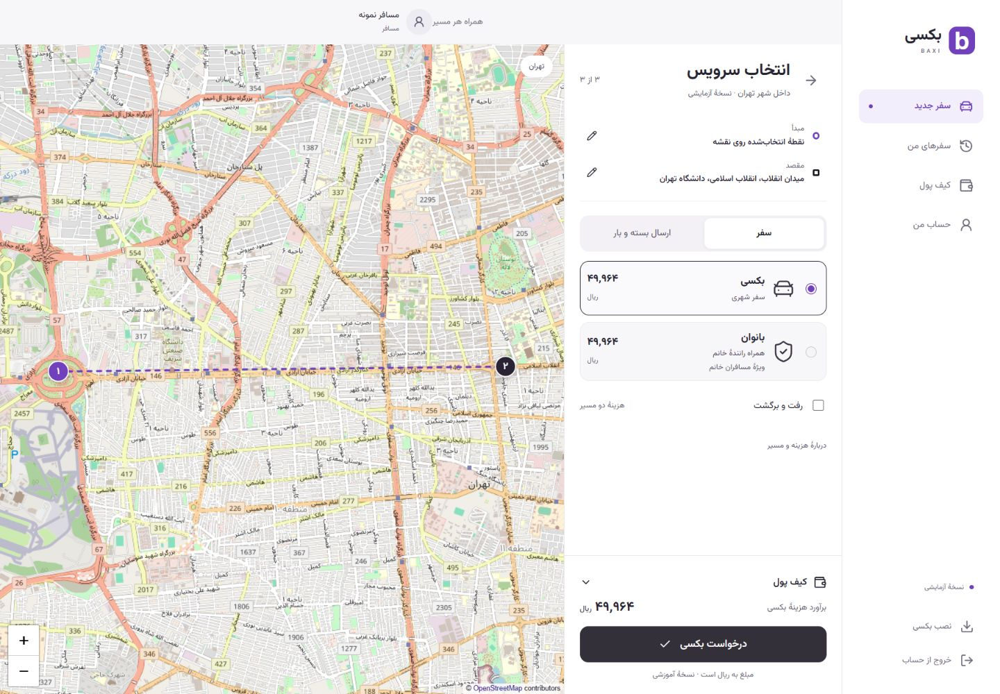

# BAXI · بکسی

A Persian, right-to-left ride and cargo **Progressive Web App**, rebuilt from a university database project. One responsive interface serves passengers, drivers and staff, backed by a Python API and MySQL transactions.

[راهنمای فارسی](docs/README.fa.md) · [روایت پروژه](docs/case-study.fa.md) · [بررسی UX و تصمیم‌های طراحی](docs/ux-review.fa.md) · [Architecture](docs/architecture.md) · [Database](docs/database.md) · [Security](SECURITY.md) · [Verification](docs/verification.md)



## Run the complete local demo

Install Docker Desktop with Compose, then run from the repository root:

```sh
docker compose up --build -d
```

Open **[http://localhost:8080](http://localhost:8080)**. The API, frontend and database start together; synthetic accounts, documents and completed journeys are seeded automatically. The app is exposed on the local machine only. The first build needs internet access to download dependencies and container images.

`docker compose down` stops the app and preserves its data. Database files and uploaded documents live in named volumes. The schema initializer runs only on an empty database. This is a new installation, **not an in-place migration of an old BAXI server**. Existing installations of the first rebuilt PWA must apply the additive [booking-context upgrade](docs/database.md#upgrading-an-existing-pwa-demo) before starting this API.

### Try each role

Choose passenger, driver or staff on the sign-in screen. “ورود با حساب نمونه” opens the corresponding demo account. Phone codes appear on the screen in this explicitly educational mode; no SMS is sent.

| Role | Synthetic account |
| --- | --- |
| Passenger | `09120000010` |
| Female passenger | `09120000020` |
| Passenger driver | `09120000030` |
| Female driver | `09120000040` |
| Box courier | `09120000050` |
| Cargo driver | `09120000060` |
| Driver awaiting review | `09120000070` |
| HR manager / reviewer | Personnel code `9001` / `9002` |

Staff demo password: `BaxiDemo!2026`. These are public, synthetic demo credentials, unsuitable for public deployment. To demonstrate a journey, use two browser profiles or a private window: request as a passenger, start work as a driver, accept, start and finish the trip, then rate it on the trip receipt.

## Implemented experience

- **Passengers:** phone sign-in and registration; four services (BAXI, WOMEN, BOX, BAAR); Tehran-only map-first booking with sequential origin/destination confirmation, explicit public-place search and optional device location; comparable service prices and passenger-selected payment; assigned driver/vehicle identity, trip receipt; passenger round trips; cargo weight, value and fragility; request cancellation before departure; live status polling; history, rating and simulated wallet top-ups.
- **Drivers:** registration with vehicle details and four private documents; pending/approved/rejected verification; map/device-based location editing and eligible requests within 5 km; capacity and WOMEN eligibility checks; acceptance, departure and completion; wallet or recorded cash settlement; ratings and simulated withdrawals.
- **Staff:** personnel sign-in, private document review, recorded approval/rejection. HR managers can create staff accounts and execute all 20 read-only reports.
- **PWA:** RTL responsive layouts, bundled Vazirmatn fonts, install manifest, standard/maskable icons, standalone launch, public app shell available offline. Requests and account changes require a connection; private API responses and documents are never cached by the service worker.
- **Data integrity:** parameterized queries, short database sessions, atomic multi-table operations, row locks for competing acceptances, single settlement and rating, idempotent wallet transfer keys, salted staff password hashes and synthetic demo data.

Booking uses a real OpenStreetMap basemap, movable center pin and explicit origin/destination confirmation, restricted to the Tehran city boundary in both browser and API. See [map coverage and attribution](docs/map.md). Pricing uses straight-line geodesic distance in integer **IRR (ریال)**, not road distance, traffic or ETA. Demo insurance and wallet operations move no real money. [Feature boundaries and original work](docs/provenance.md) explain what is implemented and what remains a future integration.

## Install as an app

After opening the production build online once, use Chrome/Edge’s install action, or Safari → Share → Add to Home Screen on iPhone. A self-hosted installation requires HTTPS for service workers and device features; localhost is suitable for local testing. `npm run dev` intentionally does not register the production service worker. No app-store package is required.

## Develop locally

Python 3.12+, Node.js 24+, and MySQL 8.4 are the supported development baseline.

```sh
docker compose up -d mysql
python -m venv .venv
```

Activate `.venv` (`.venv\Scripts\Activate.ps1` on PowerShell, `source .venv/bin/activate` on Linux/macOS), copy `.env.example` to `.env`, then:

```sh
python -m pip install -r requirements-dev.txt
python scripts/seed_demo.py
npm ci
python -m uvicorn api:app --app-dir src --host 127.0.0.1 --port 8000
```

In another terminal: `npm run dev`, then open [http://127.0.0.1:5173](http://127.0.0.1:5173). Vite proxies `/api` to Python; browser code never receives database credentials. API documentation: [http://127.0.0.1:8000/api/docs](http://127.0.0.1:8000/api/docs).

For installation/offline testing, run `npm run build` and `npm run preview` instead. Preview runs at port `4173` with the same API proxy. If PyPI is inaccessible in your region, select a trusted reachable package index locally; Docker accepts the optional `BAXI_PIP_INDEX_URL` setting in your untracked `.env`. The default remains official PyPI.

## Verify changes

```sh
ruff check src scripts tests
ruff format --check src scripts tests
python -m pytest -q
npm run build
npm run test:e2e
```

Set `BAXI_RUN_INTEGRATION=1` to include MySQL/API tests **only against an initialized, seeded disposable local database**. Otherwise those tests are skipped. Browser tests require the API running on port 8000 and Chrome installed; they start the production preview automatically. For bundled Chromium, run `npx playwright install chromium` and set `BAXI_BROWSER_CHANNEL=chromium`. Browser tests modify only designated synthetic demo accounts.

GitHub Actions runs the build, Python/MySQL tests and browser checks using an isolated database. See [verification evidence and limitations](docs/verification.md).

## Repository

```text
web/                   React screens, shared UI, API client, responsive styles
src/                   FastAPI endpoints, application rules, auth and DB access
db/                    Fresh MySQL schemas, views, triggers, restricted local grants
scripts/               Synthetic seed, monthly aggregation, PWA build utilities
tests/                 Unit, real MySQL/API and Playwright browser tests
public/                Manifest and install icons
assets/demo-documents/ Explicitly synthetic identity/vehicle documents
docs/screenshots/      Screens captured from the running PWA
docs/legacy/           Original Qt sources, UI screenshots and EER artifacts
```

## Origin and credits

Originally built by **Navid, Sajad and Arsham** for the **db4022 database course at Bu-Ali Sina University**. The original project used PyQt6 and MySQL. This PWA is a later reconstruction and redesign; individual historical contributions have not been verified. Original design sources and Git history are retained for provenance, while the active application has been replaced.

[Legacy artifacts and Figma references](docs/provenance.md) · [Changes from the original](CHANGELOG.md) · [Contributing](CONTRIBUTING.md)

No project-wide open-source license has been selected or verified with all original contributors. Public visibility alone does not establish permission to redistribute the original code or design assets. Third-party dependencies retain their own licenses.
