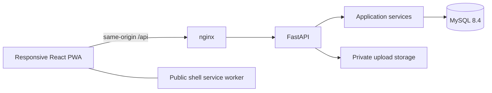
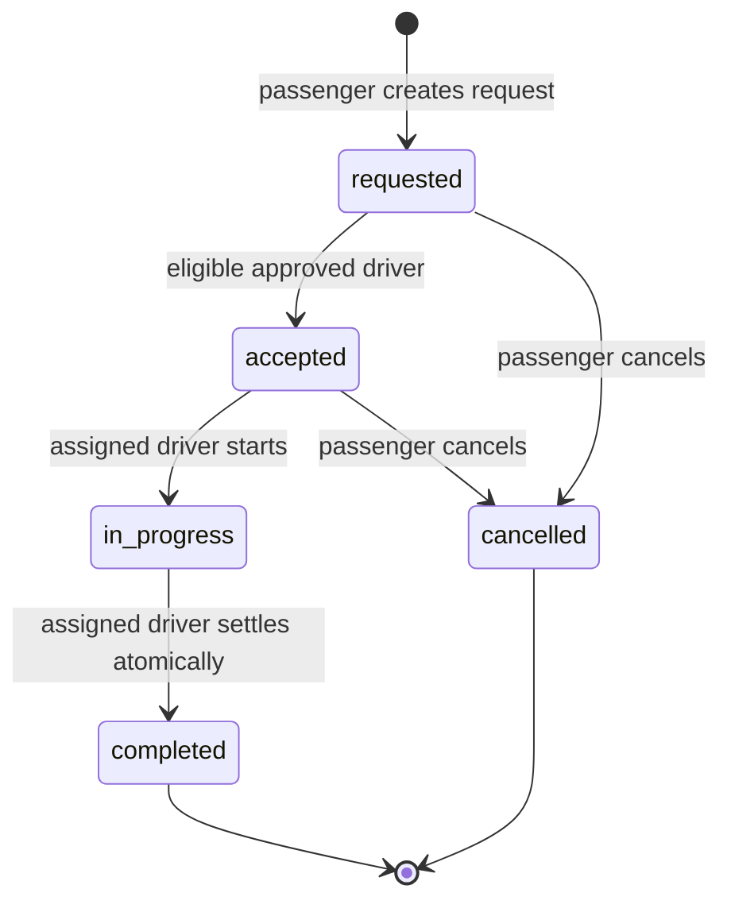

# Architecture

The browser talks only to a same-origin API. MySQL and document storage are never directly exposed to the frontend. Docker Compose puts nginx in front of a single Python API process; only nginx and the local development database port bind to loopback.

## Responsibilities

- `web/`: separate passenger, driver, registration, wallet, staff and authentication screens; `ui.tsx` provides shared controls and the explicitly schematic route illustration; `lib.ts` contains API transport, types, formatting and Persian error translation.
- `api.py`: validates request shapes, looks up server-side session identity, enforces role/ownership, serves authorized documents and exposes a fixed report catalog. The caller cannot supply another account ID for an owned operation.
- `services.py`: domain validation, state transitions, eligibility, transaction boundaries and explicit locks.
- `database.py` / `db_session.py`: parameterized queries, short-lived connections and a context-local shared transaction. Importing a module never connects or writes data.
- `db/main.sql`: foreign keys, checks, uniqueness, trip-cost views and wallet posting triggers; integer IRR avoids binary floating-point money.

## Trip state

One active request per passenger and one active accepted/in-progress trip per driver are enforced through account row locks and checks inside the API transaction. Competing drivers lock the same request; only one can move it out of `requested`. Completion inserts one acceptance/settlement row and updates status in the same transaction. A repeat completion returns without charging again. Rating is conditional on ownership, completion and an empty rating field.

## Money

Rates per geodesic kilometre: passenger/WOMEN 10,000 IRR; BOX 8,000; BAAR 20,000. Passenger return journeys double the base fare. BOX adds 2% of declared cargo value as demo insurance. Decimal rounding produces an integer quote.

Wallet payment debits the passenger and credits `floor(fare × 0.8)` to the driver. Recorded cash payment leaves the passenger wallet alone and debits the driver's wallet by `ceil(fare × 0.2)` as commission. Insufficient funds reject and roll back the entire operation. Demo deposit/withdrawal keys identify one account, operation and amount; retries do not post twice. These rules demonstrate database integrity, not bank settlement or insurance coverage.

## PWA and offline behavior

The production build generates install icons and a service worker with a content-derived cache name. Only the known public build resources are precached. Same-origin navigation falls back to the public index when offline. API routes, uploads, cross-origin requests and mutations are excluded. Cache matching ignores `Vary` only for this fixed public asset allowlist, so production-preview module requests work offline as well.

The client does not persist sessions, documents or trip records in localStorage/IndexedDB. A page already open retains its state in memory; reloading offline returns to the public sign-in shell. There is no background queue for financial operations or booking mutations. Connectivity is required for fresh account state. UI polling runs every five seconds rather than claiming real-time dispatch.

## Operating limits

Sessions, OTPs and rate limits are process-local and bounded. They expire, and an API restart signs users out. Run **one API worker** for this educational deployment. A public, multi-instance product needs shared session/rate-limit storage, operational observability, a real SMS provider, road routing, verified identity/payment integrations and retention controls. Setting demo mode to false disables simulated OTP issuance and wallet transfers; it does not add real providers.

The schema is a clean installation. Original data, credentials and manually seeded personal-looking records are not migrated. `docs/legacy/database` describes the historical schema, while [database.md](database.md) describes the current one.
