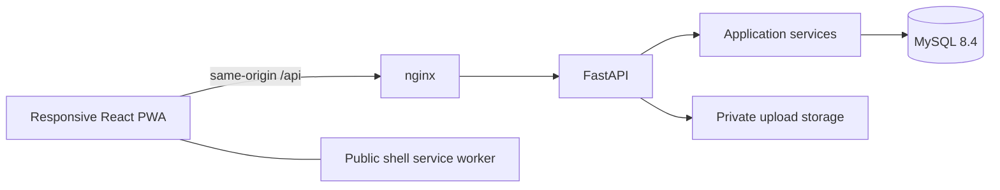
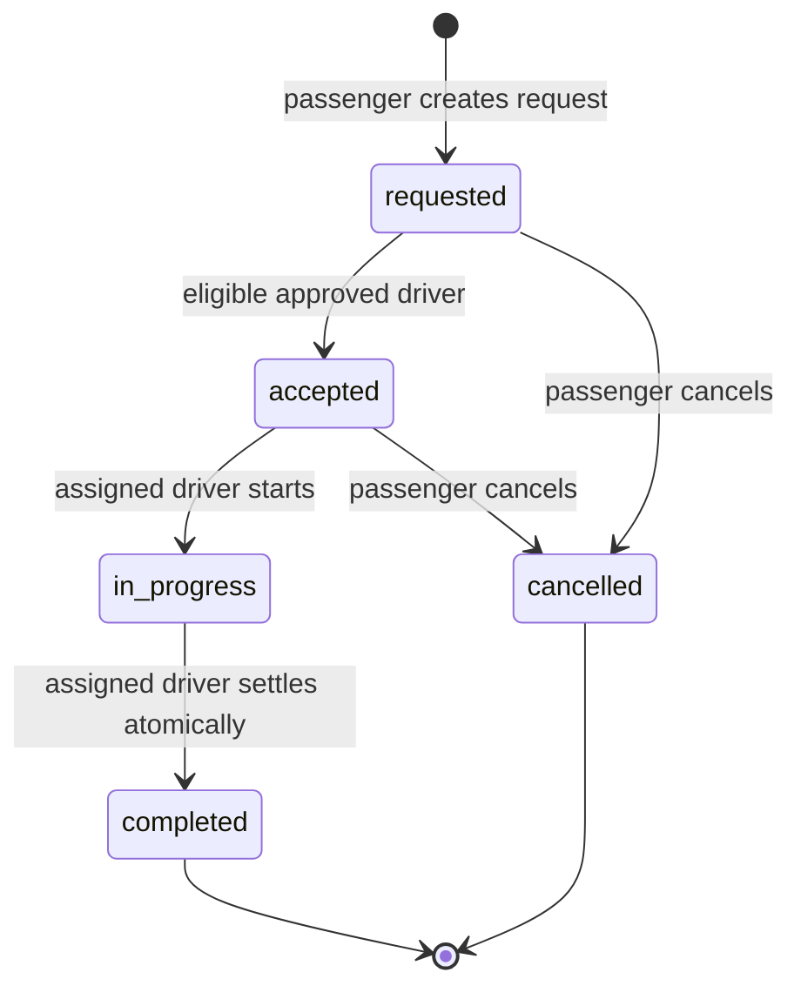

# Architecture

The browser talks only to a same-origin API. MySQL and document storage are never directly exposed to the frontend. Docker Compose puts nginx in front of a single Python API process; only nginx and the local development database port bind to loopback.

## Responsibilities

The [repository structure](repository-structure.md) separates runtime code, infrastructure, shared data and tests. Root npm commands orchestrate the frontend; Python tooling targets the `baxi` package under `backend`.

- `frontend/src/features/`: separate passenger, driver, registration, wallet, staff and authentication screens; `shared/map/RoutePicker.tsx` provides a lazy-loaded Leaflet map with sequential origin/destination confirmation, while `shared/ui/ui.tsx` provides shared controls and the decorative sign-in illustration; `shared/lib/client.ts` contains API transport, types, formatting and Persian error translation.
- `NewTrip.tsx` / `PassengerJourney.tsx`: a controlled booking draft, map and fixed-action sheet, followed by assigned-vehicle status, cancellation dialog and inline receipt/rating. Confirmed draft state survives wallet navigation only in memory.
- `backend/baxi/geo/places.py`: explicit cached public-place geocoding with a shared single-process upstream rate limit and independently checked Tehran results.
- `backend/baxi/api.py`: validates request shapes, looks up server-side session identity, enforces role/ownership, serves authorized documents and exposes a fixed report catalog. The caller cannot supply another account ID for an owned operation.
- `backend/baxi/geo/service_area.py` / `frontend/src/shared/map/serviceArea.ts`: point-in-polygon checks against the same versioned Tehran GeoJSON; both trip endpoints and driver availability must be inside the city.
- `backend/baxi/application/services.py`: domain validation, state transitions, eligibility, transaction boundaries and explicit locks.
- `backend/baxi/db/queries.py` / `backend/baxi/db/session.py`: parameterized queries, short-lived connections and a context-local shared transaction. Importing a module never connects or writes data.
- `database/main.sql`: foreign keys, checks, uniqueness, trip-cost views and wallet posting triggers; integer IRR avoids binary floating-point money.

## Trip state

One active request per passenger and one active accepted/in-progress trip per driver are enforced through account row locks and checks inside the API transaction. Competing drivers lock the same request; only one can move it out of `requested`. Completion inserts one acceptance/settlement row and updates status in the same transaction. A repeat completion returns without charging again. Rating is conditional on ownership, completion and an empty rating field.

## Money

The server's versioned `backend/baxi/pricing/policy.json` defines sample base, per-kilometre and minimum fares, weight bands, commission and half-up rounding. Passenger and WOMEN tariffs match. Distance is geodesic, not a road route; cargo value is informational and no insurance premium is charged. See the complete [Persian pricing policy](pricing.fa.md) for tariff amounts and examples.

`POST /api/quote` persists a client-owned, draft-bound five-minute quote. Booking requires its ID, rejects browser-supplied amounts and locks the client and quote before creating one request and its immutable pricing snapshot. Retries return the same request, including after expiry; a different trip needs a fresh quote. A policy version cannot be reused with different content. An already issued, unexpired quote remains valid after a new policy is loaded. Startup checks policy consistency; a single-process maintenance task removes only unbooked quotes expired for over a day at startup and every 24 hours, retrying database failures after one hour.

The passenger selects wallet or cash before booking. The choice and place labels are persisted; changing them does not alter the quote. Explicit wallet requests check funds before insertion, and completion enforces the selected method. Legacy requests with a null preference retain their earlier payment workflow.

Money remains integer IRR in the API and database. All UI money is displayed/entered in toman; whole-toman input is multiplied by ten at the UI boundary and historical fractional tomans retain one decimal. Completion uses the stored driver net and commission, not today's tariff. Wallet payment debits the fare and credits driver net; recorded cash leaves the passenger wallet unchanged and debits only commission. Reports use the same net snapshot. Legacy trips without snapshots retain their original fares and 20% commission; their receipts explicitly lack a breakdown. Insufficient funds roll back the whole settlement. Demo transfer keys remain idempotent. These rules demonstrate integrity, not bank settlement or insurance coverage.

## PWA and offline behavior

The production build generates install icons and a service worker with a content-derived cache name. Only the known public build resources are precached. Same-origin navigation falls back to the public index when offline. API routes, uploads, cross-origin requests and mutations are excluded. Cache matching ignores `Vary` only for this fixed public asset allowlist, so production-preview module requests work offline as well.

The client does not persist sessions, documents or trip records in localStorage/IndexedDB. A page already open retains its state in memory; reloading offline returns to the public sign-in shell. There is no background queue for financial operations or booking mutations. Connectivity is required for fresh account state. UI polling runs every five seconds rather than claiming real-time dispatch.

## Operating limits

Sessions, OTPs and rate limits are process-local and bounded. They expire, and an API restart signs users out. Run **one API worker** for this educational deployment. A public, multi-instance product needs shared session/rate-limit storage, operational observability, a real SMS provider, road routing, verified identity/payment integrations and retention controls. Setting demo mode to false disables simulated OTP issuance and wallet transfers; it does not add real providers.

The schema is a clean installation. Original data, credentials and manually seeded personal-looking records are not migrated. `docs/legacy/database` describes the historical schema, while [database.md](database.md) describes the current one.
