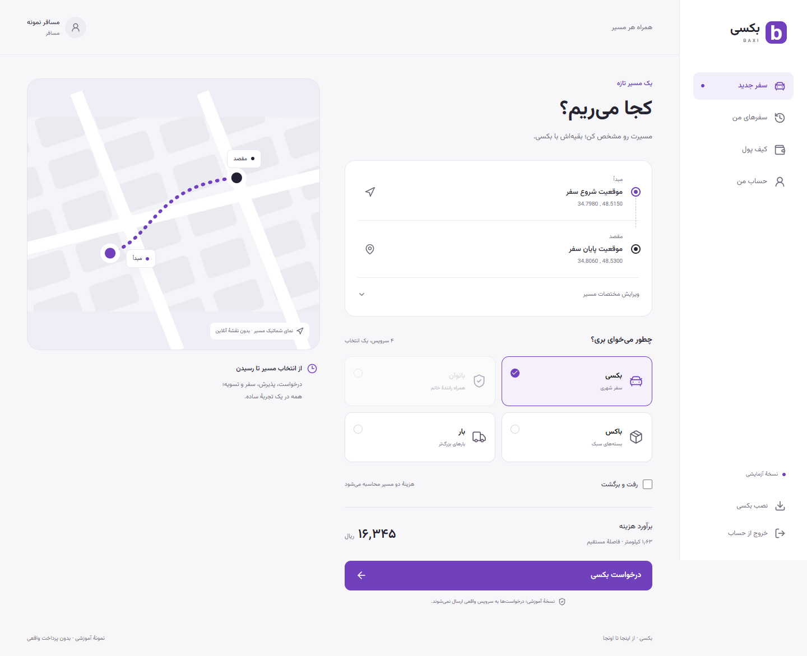

# بکسی؛ از پروژهٔ پایگاه داده تا PWA

بکسی یکی از پروژه‌های دوران کارشناسی سجاد است که همراه نوید و آرشام برای درس پایگاه داده در دانشگاه بوعلی سینا ساخته شد. ایدهٔ پروژه، مدل‌سازی درخواست سفر و حمل بار در یک سامانه با نقش‌های مسافر، راننده و کارکنان بود.

## پروژهٔ اصلی

چهار سرویس سفر شهری، بانوان، بستهٔ سبک و بار سنگین، به یک مدل مشترک از حساب، درخواست، وسیله، سفر و تسویه نیاز داشتند. پروژه از MySQL برای روابط، محدودیت‌ها، Viewها و Triggerها و از PyQt6 برای رابط دسکتاپ استفاده می‌کرد. طراحی‌های Qt، تصاویر رابط و مستندات EER اصلی برای مراجعهٔ تاریخی حفظ شده‌اند.

سهم دقیق هر عضو تیم در طراحی، پیاده‌سازی و دیتابیس مشخص نشده است؛ این نوشته موفقیت‌های تجاری، کاربر واقعی، نمره یا نتیجهٔ اندازه‌گیری‌نشده‌ای به پروژه نسبت نمی‌دهد.

## بازسازی بعدی

در بازسازی سال ۲۰۲۶، هدف این بود که پروژه دوباره قابل اجرا و قابل بررسی شود و روی موبایل هم کار کند. رابط به یک PWA فارسی و مینیمال تبدیل شد و دسترسی دیتابیس پشت API قرار گرفت. این بازسازی با کمک AI انجام شده و باید از کار دانشگاهی اولیه جدا معرفی شود.

رابط جدید، انتخاب مسیر، نوع سرویس و هزینه را در یک جریان روشن قرار می‌دهد. در موبایل، فرم تک‌ستونه و ناوبری پایین صفحه استفاده می‌شود. نسخهٔ دسکتاپ فضای بیشتری برای نمای شماتیک مسیر و ناوبری کناری دارد.

## مسئله‌های فنی که اصلاح شدند

- دادهٔ یک سفر نباید به سفر بعدی نشت کند؛ پیش‌نویس‌ها مستقل و تغییرناپذیر شدند.
- دو راننده نباید یک درخواست را هم‌زمان بپذیرند؛ قفل ردیف و تراکنش، پذیرش را به یک برنده محدود می‌کند.
- ثبت بخشی از سفر نباید بدون مقصد یا جزئیات سرویس باقی بماند؛ ثبت چندجدولی اتمیک شد.
- پایان سفر یا تکرار درخواست شبکه نباید مبلغ را دوباره جابه‌جا کند؛ تسویه و انتقال کیف پول در برابر تکرار کنترل شدند.
- موقعیت مکانی، سرویس بانوان، ظرفیت بار و مالکیت عملیات باید در سرور بررسی شوند؛ محدود کردن رابط به‌تنهایی کافی نیست.
- ظاهر موفقیت نباید جای موفقیت واقعی را بگیرد؛ رابط از نتیجهٔ API و دادهٔ ذخیره‌شده استفاده می‌کند.

## چیزی که می‌توان نمایش داد

در دو پنجرهٔ مرورگر، مسافر یک سفر می‌سازد و راننده آن را می‌پذیرد، شروع می‌کند و به پایان می‌رساند. سپس تغییر کیف پول و امتیازدهی دیده می‌شود. پنل کارکنان هم ثبت‌نام راننده، چهار مدرک ساختگی، تأیید یا رد و گزارش‌های دیتابیس را نمایش می‌دهد.

این نمایش، یک نمونهٔ آموزشی است. نقشهٔ آنلاین، پیامک واقعی و پرداخت بانکی هنوز متصل نیستند. نصب PWA و باز شدن پوستهٔ عمومی آفلاین قابل آزمایش‌اند؛ اطلاعات خصوصی در کش آفلاین نگهداری نمی‌شود. [شواهد آزمون‌ها](verification.md) محدودهٔ بررسی را ثبت می‌کنند.
