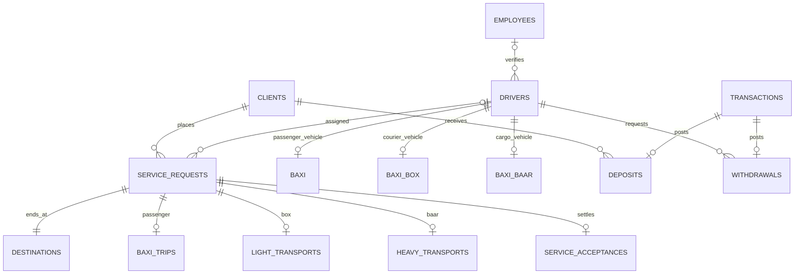

# Database model

`database/main.sql` initializes two empty MySQL 8.4 schemas using InnoDB and utf8mb4. It does not drop, overwrite or migrate an existing installation. Bootstrap uses an administrative account; the running API uses the CRUD-only grants in `database/local-grants.sql`.



The diagram shows the active core. The SQL supports multiple numbered destinations; the current API creates one destination per request. Exactly one service-detail row is created by the application transaction; the schema alone does not prohibit an administrator from inserting incompatible subtype rows.

## Key records

| Record | Purpose and important constraints |
| --- | --- |
| `employees` in `baxi_staff` | Personnel code, unique IBAN, scrypt password, department/position, nonnegative salary |
| `clients`, `drivers` | Unique normalized ten-digit Iranian phone; integer, nonnegative wallet; demographic fields |
| `drivers` | Pending/approved/rejected status, rejection reason, private document references, verifier; nullable last reported coordinates |
| `baxi`, `baxi_box`, `baxi_baar` | One vehicle row per driver/service table; capacity > 0, unique plate within table |
| `service_requests` | Surrogate request ID; explicit service and state; passenger, optional assigned driver; lifecycle timestamps; validated coordinate ranges |
| `destinations` | Request ID plus numbered stop; latitude, longitude and city |
| Service details | Passenger/round trip, heavy cargo, or light cargo with a retained legacy insurance column (zero for new trips); nonnegative integer fare/value |
| `pricing_policies`, `fare_quotes`, `trip_pricing` | Version/content fingerprint, owned expiring quote and immutable booked fare/net/breakdown; one quote per trip |
| `service_acceptances` | One completed settlement per request, driver and payment method; separate nullable 0–5 ratings |
| `transactions` | Unique 32-hex key, positive integer amount, state and incoming/outgoing type; completed records cannot be updated |
| `deposits`, `withdrawals` | Unique posting links, account ownership; triggers require the correct completed transaction type |
| `monthly_incomes` | Unique driver/month, gross and net summaries, recomputed from completed settlements |

The remaining historical domain concepts—referrals, reports, addresses, compliments/complaints, company bonuses and compensatory deposits—have schema support and some reporting/triggers, but do not have complete public API/UI workflows. Do not infer a working product feature from a table's existence.

## Integrity boundaries

Application transactions implement the allowed trip transitions, one active trip per account, eligibility, capacity and ownership. Foreign keys/checks enforce basic shape and wallet lower bounds. Raw direct SQL is an administrator capability, outside the authenticated API contract. Wallet triggers apply only when a settlement/posting link is inserted, and failures roll back the enclosing transaction.

Coordinates are `(latitude, longitude)` in Python/forms, and `POINT(longitude, latitude)` in MySQL distance functions. The nearby cutoff is 5,000 metres. A regression test uses an eastward boundary case where swapping axes would change eligibility. This follows [MySQL's spatial function documentation](https://dev.mysql.com/doc/refman/8.4/en/spatial-convenience-functions.html).

## Monthly income

Run after the relevant month’s activity:

```sh
python backend/scripts/monthly_income.py 2026-10-01
```

The job replaces only that month's summary in one transaction. It uses `SUM` per settlement and `UNION ALL` through the cost view, retaining distinct trips with equal fares. No global event-scheduler permission is required. The seed creates an initial summary; subsequent trips need the command to refresh it.

## Reports

The fixed catalog in `backend/baxi/application/reports.py` contains 20 parameter-free, read-only queries. Only an HR department manager can execute them. The PWA displays each report's columns and handles empty results; it never accepts arbitrary SQL from a browser. Report IDs and Persian names are exposed by `/api/staff/reports`.

Original EER/ODT/PDF artifacts in `docs/legacy/database/` are preserved historical materials and do not describe this replacement schema.


## Upgrading an existing PWA demo

Fresh volumes use the current `database/main.sql`. For an existing **rebuilt PWA** database from commit `f76614e` or earlier, back up both schemas and uploads, stop only the API/web containers, then apply `database/migrations/002-booking-context.sql` using a database administrator. Then apply `database/migrations/003-pricing.sql` for versioned tariffs, expiring quotes and immutable fare/commission snapshots. It leaves legacy amounts unchanged and retains their 20% settlement fallback. Both migrations can be reapplied. The booking-context migration checks for each column before adding it; it can be run again. It adds nullable passenger payment and origin/destination labels, preserving existing trips and their settlement rules. It does not migrate the historical Qt schema.

For the local Compose demo in PowerShell:

```powershell
docker compose stop api web
New-Item -ItemType Directory -Force artifacts | Out-Null
docker compose exec -T -e MYSQL_PWD=baxi-local-root-only mysql mysqldump -uroot --databases baxi_users baxi_staff --single-transaction --no-tablespaces | Set-Content -Encoding utf8 artifacts/pre-upgrade.sql
Get-Content -Raw -Encoding utf8 database/migrations/002-booking-context.sql | docker compose exec -T -e MYSQL_PWD=baxi-local-root-only mysql mysql --default-character-set=utf8mb4 -uroot
Get-Content -Raw -Encoding utf8 database/migrations/003-pricing.sql | docker compose exec -T -e MYSQL_PWD=baxi-local-root-only mysql mysql --default-character-set=utf8mb4 -uroot
docker compose up --build -d
```

Store that backup outside version control and retain the existing named volumes; no volume deletion or reset is required. The running restricted application user does not receive DDL permission. Old requests have null `preferred_payment` and preserve their previous end-of-trip payment selection; newly created UI requests record and enforce the passenger's choice.

The API validates and registers the active pricing policy at startup. Its single-process maintenance task runs quote cleanup at startup and daily; booked quotes are retained. Change tariff versions before restarting the API; see [pricing policy](pricing.fa.md). No database event-scheduler or new runtime DDL grant is needed.
